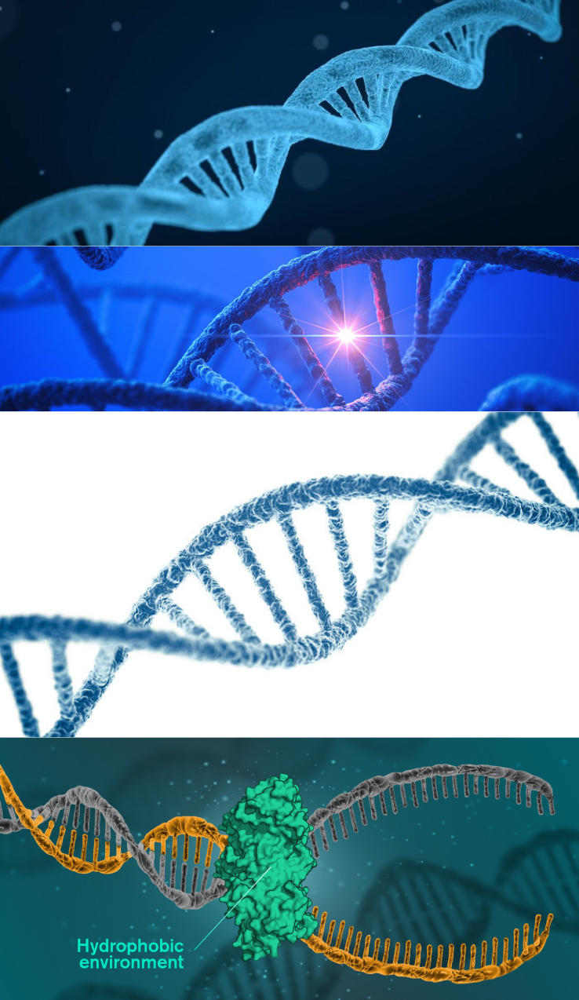
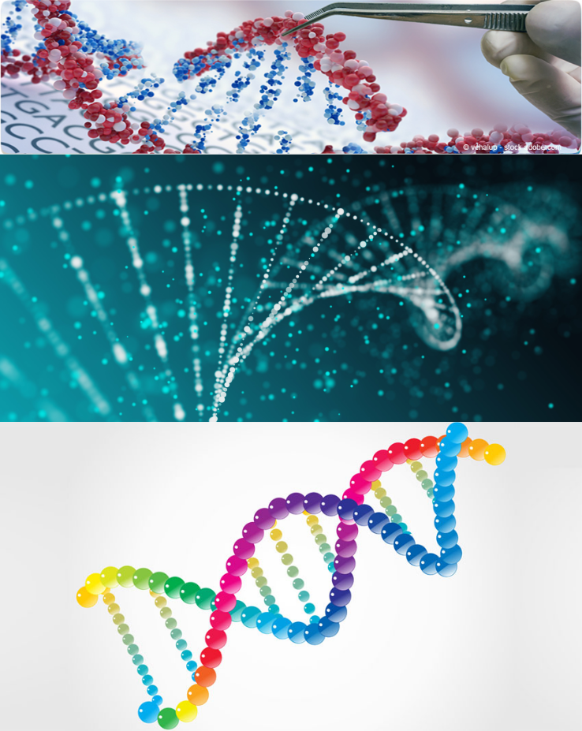
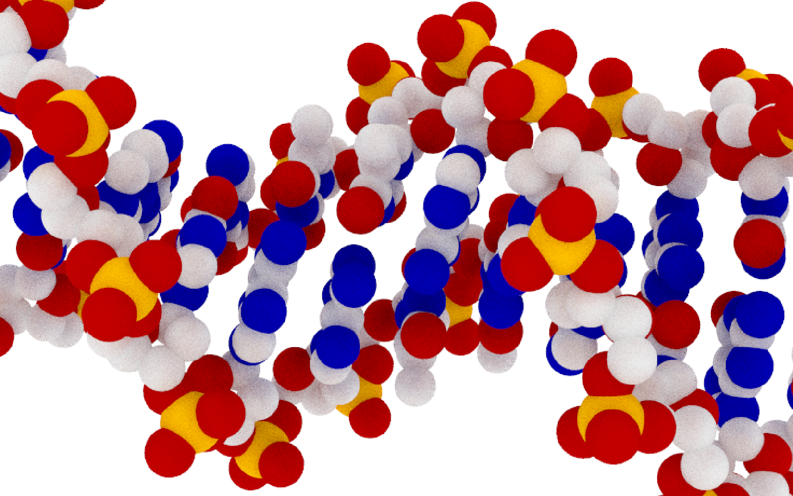
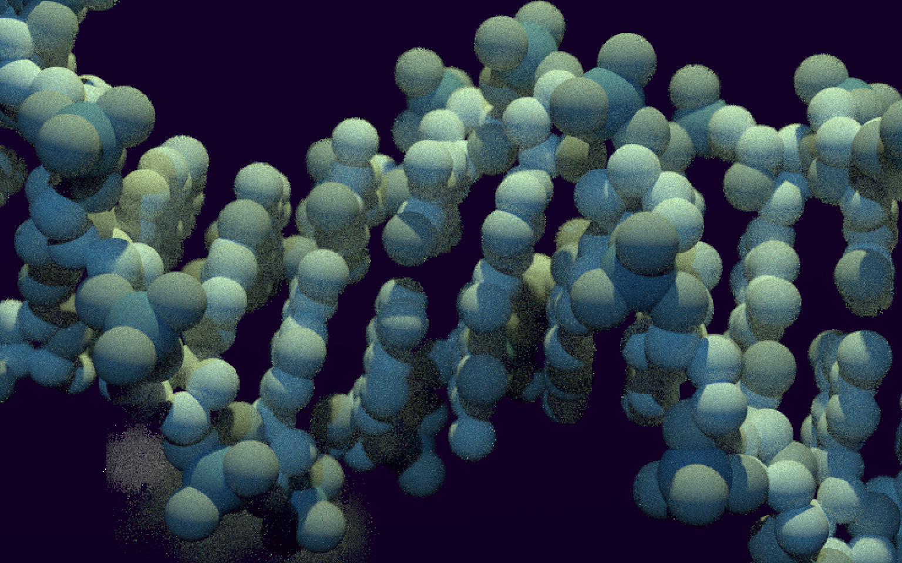
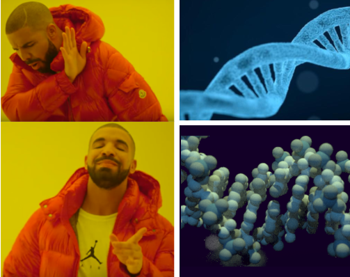

---
authors:
- admin
categories: []
date: "2020-04-15T00:00:00Z"
draft: false
featured: false
image:
  caption: ""
  focal_point: ""
projects: []
tags: []
title: DNA的形状
---

大家在媒体上见到的DNA形状，往往是"艺术“加工过的，比如：



还有追求艺术化而完全与实际形状不符的，比如：




GUILLAUME DEVAILLY在他的博客[The shape of DNA](https://gdevailly.netlify.com/post/the-shape-of-dna/)中，用R语言做出比较符合科学实际的DNA形状：






总而言之，



代码不长，具体解释可前往该博客查阅：

```{r}
library(bio3d)
dna <- read.pdb("1BNA")
library(dplyr)
dnamod <- filter(dna$atom, type == "ATOM" ) %>%
    select(x, y, z, atom = "elesy
library(rayrender)
library(purrr)
# 模型
mol <-  map_dfr(
    unique(dnamod$atom), # one iteration for each tom type, C, N, O, P
    function(ato) {
        melref = filter(elref, atom == ato)
        dnamo = filter(dnamod, atom == ato)
        sphere(
            x = dnamo$x, y = dnamo$y, z = dnamo$z,
            radius = 0.4 * melref$atomic_mass^(1/3),
            # radius is proportionnal to the cubic root of the atomic mass. 
            # 0.4 is a magic number leading to a visualisation that doesn't look too bad.
            material = diffuse(color = melref$color)
        )
    }
)
# 渲染图形1
render_scene(
    mol,
    lookfrom = c(60, 0, -10),
    lookat = c(0, 0, 0),
    parallel = TRUE, width = 800, height = 500, samples = 100,
    backgroundhigh = "white", backgroundlow = "white"
)
#构建和渲染图形2
elref <- tribble(
    ~atom, ~atomic_mass, ~color,
    "C", 12, "azure1",
    "N", 14, "azure3",
    "O", 16, "azure4",
    "P", 31, "steelblue4"
)

mol <-  map_dfr(
    unique(dnamod$atom),
    function(ato) {
        melref = filter(elref, atom == ato)
        dnamo = filter(dnamod, atom == ato)
        sphere(
            x = dnamo$x, y = dnamo$y, z = dnamo$z,
            radius = 0.4 * (melref$atomic_mass)^(1/3),
            material = diffuse(color = melref$color)
        )
    }
) %>% 
    # first light, magic numbers
    add_object(sphere(
        x = 120, y = 50, z = -10, material = light("dodgerblue", intensity = 3000) 
    )) %>%
    # second light, magic numbers
    add_object(sphere(
        x = 20, y = 70, z = -10, material = light("darkolivegreen1", intensity = 3000) 
    )) %>%
    # a big spheric mirror somewhere on the back
    add_object(sphere(
        x = -450, y = -100, z = 160, radius = 400, material = metal(fuzz = 0.05) 
    ))

render_scene(
    mol,
    lookfrom = c(60, 0, -10),
    lookat = c(0, 0, 0),
    aperture=0.8, focal_distance = 55,  clamp_value = 5,
    ambient_light = TRUE, backgroundhigh = "#010005", backgroundlow = "black",
    parallel = TRUE, width = 800, height = 500, samples = 600
)

```

