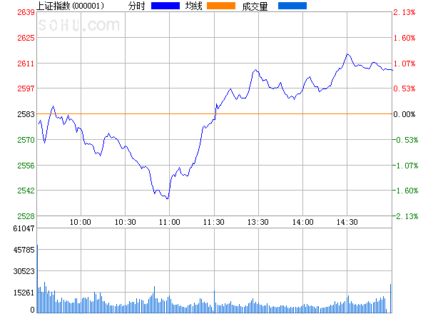

```{r setup, include=FALSE}
knitr::opts_chunk$set(
  echo = TRUE,           # show code
  warning = FALSE,       # don't show warnings
  message = FALSE,       # don't show messages (less serious warnings)
  cache = FALSE,         # set to TRUE to save results from last compilation
  # pdf.options(family="GB1") #生成PDF图时显示中文
  fig.align = 'center',  # center figures
  out.width = '75%',     # Set figure size to 75% of textline width
  tidy = TRUE,
  fig.asp = .75          # width-height ratio 
)
# Load libraries you need to use
  library(tidyverse) 
  library("bookdown")
  #library("bookdownplus")
  set.seed(2018)         # make random results reproducible
```

# Markdown 基本语法

## 段落

Markdown中，一个段落由一行或连续的多行组成。段落之间以**空行**分隔。同一段落内的*不同行*仅表示*空格*。

为了在**段内换行**，可在前行末尾输入*两个或两个以上空格*。 也可以输入`<br>`分行，但是仅对`html`和`word`格式有效，对`pdf`格式无效。

## 段内文字格式

- 斜体：星号或下划线包围的内容是**强调**格式，如 `_text_` or `*text*`：*text*。
- 黑体：双星号或双下划线包围的内容是**加重**格式，如 **text**，`__text__` or `**text**`。
- 下标：两个`~`包夹的内容为下标，如`H~2~SO~4~` 显示为 H~2~SO~4~。
- 上标：两个`^`包夹内容为上标， `R^2^` 显示为 R^2^。
- 显示代码：两个反向单撇号内，如 `` `code` ``，显示为：`code`^[要把反向单撇号作为一般字符（而不是代码表示符），可以在外围用比它多的反向单撇号表示，如``` `` `code` `` ```。]。
- 为了使得某些有特殊意义的字符不作特殊解释， 可以在该字符前面加上反斜杠`\`，取消其特殊含义。比如，要插入普通的星号或下划线，可以使用反斜杠保护 `\*`， 或者写成段内代码格式``` `*` ```。
- 插入图片： ``，更好的图形插入方式在第\@ref(graph)节介绍。
- 脚注：`^[脚注文本]`。例如，这里插入脚注^[所谓“脚注”，就是在页脚对某些文字的注释。] 

## 标题和分隔线

- 一级标题: 以井号`#`开头，或在标题下面一行输入多个等号`========`；
- 二级标题:两个井号`##`开始。 或在标题下面一行输入多个减号`--------`；
- 标题行前面应该空一行；
- 用三个或三个以上连续的星号组成的行， 可以转换成分隔线;
- 标题不编号：标题后增加`{-}`，如本文最后标题“`# 参考文献 {-}`”。

## 引用段落

在段落的每行前面加一个大于号`>`，表示引用。

  >凡事只要看得淡些，就没有什么可忧虑的了；只要不因愤怒而夸大事态，就没有什么事情值得生气的了。
  >  ——屠格涅夫

## 列表

不编号列表：以 `*`、 `-` 或 `+`开头，空两格。下一行再空四个空格可以嵌套，如：

```markdown
- 第一项
- 第二项
    - 第二项的第一项
    - 第二项的第二项
```
结果：

- 第一项
- 第二项
    - 第二项的第一项
    - 第二项的第二项

带编号列表：

```markdown
1. 第一项
2. 第二项
3. 第三项
```

## 源程序代码

三个或以上连续的反向单撇号表示代码开头与代码结束，缩进四个空格也可以。

````markdown
```
这是代码
```

或缩进四个空格:

    这是代码
````

使用栅栏式代码块，可以彩色语法和行号显示等多种选项，如.cpp表示C++，.c表示C，.r表示R，.python表示python等。 选项.numberLines要求该代码行编号， 选项startFrom=指定开始行号。

另外，如果代码内本身含有`~`行， 只要使得开头与结尾标志中的`~`个数更多就可以了。


````markdown
~~~{.python .numberLines startFrom=101}
# 计算面积函数
def area(width, height):
    return width * height
 
def print_welcome(name):
    print("Welcome", name)
 
print_welcome("Runoob")
}
~~~
````

结果：

~~~{.python .numberLines startFrom=101}
def area(width, height):
    return width * height
 
def print_welcome(name):
    print("Welcome", name)
 
print_welcome("Runoob")
}
~~~

## 链接

- 直接链接。  
`深圳大学的网页地址是： <https://www.szu.edu.cn/>` 。  
显示为 深圳大学的网页地址是： <https://www.szu.edu.cn/>。
- 行内式链接。    
`[显示的文本](链接网址)`,    
例如，请参考 `[RStudio](https://www.rstudio.com)`，    
显示为[RStudio](https://www.rstudio.com)。

# 数学公式

## Markdown公式

**行内公式**用两个美元符号，`$y=x^2$`显示$y=x^2$。

**整行公式**（display style）最简单的方法是用两双美元符号之间表示：

`$$f(x) = \frac{1}{2} \sum_{i=1}^\infty \int_0^1 \sin^2(i t x) dt.$$`，

$$
  f(x) = \frac{1}{2} \sum_{i=1}^\infty \int_0^1 \sin^2(i t x)\ \rm{d}t .
$$

**矩阵和行列式公式**

可以通过`\begin{array}`和`\end{array}`：

```latex
$$X=\left(\begin{array}{ccc}
x_{11} & x_{12} & x_{13}\\
x_{21} & x_{22} & x_{23}
\end{array}\right)$$
```

$$X=\left(\begin{array}{ccc}
x_{11} & x_{12} & x_{13}\\
x_{21} & x_{22} & x_{23}
\end{array}\right)$$

也可以通过`\begin{matrix}`和`\end{matrix}`（有b，B，p，P，v，V等多种格式）：

```latex
$$\begin{matrix}a & b\\\\c &d\end{matrix}$$
```

$$\begin{matrix}a & b\\\\c &d\end{matrix}$$
```
$$\begin{pmatrix}a & b\\\\c &d\end{pmatrix}$$
```

$$\begin{pmatrix}a & b\\\\c &d\end{pmatrix}$$

```
$$\begin{bmatrix}a & b\\\\c &d\end{bmatrix}$$
```
$$\begin{bmatrix}a & b\\\\c &d\end{bmatrix}$$
```
$$\begin{Bmatrix}a & b\\\\c &d\end{Bmatrix}$$
```

$$\begin{Bmatrix}a & b\\\\c &d\end{Bmatrix}$$

```
$$\begin{vmatrix}a & b\\\\c &d\end{vmatrix}$$
```

$$\begin{vmatrix}a & b\\\\c &d\end{vmatrix}$$
```
$$\left|\begin{matrix}a & b\\\\c &d\end{matrix}\right|$$
```

$$\left|\begin{matrix}a & b\\\\c &d\end{matrix}\right|$$
```
$$\begin{Vmatrix}a & b\\\\c &dend{Vmatrix}$$
```

$$\begin{Vmatrix}a & b\\\\c & d \end{Vmatrix}$$

分段函数：

```markdown
f(x)=
\begin{cases}
\sin(x) & x>0,\\
0 & x=0,\\
\cos(x) & x<0.
\end{cases}
```

$$
f(x)=
\begin{cases}
\sin(x) & x>0,\\
0 & x=0,\\
\cos(x) & x<0.
\end{cases}
$$

这样的整行公式输出html格式非常简单，效果也好。但是，如果要输出pdf文档或word文档，并且公式、图表的编号还要交互引用的话，就可能有问题。所以，一般情况下，建议用LaTeX的公式环境。

## LaTeX公式环境

**一行整行公式**：公式自动居中。

```markdown
\begin{equation}
y=f(x) 
\end{equation}
```
\begin{equation}
y=f(x) 
\end{equation}

关于**公式编号**：输出为html时，公式默认不编号，只有标注了的公式才编号。而输出为pdf时，一般默认为自动编号。

如果想输出的公式**不编号**，可以用`equation*` 环境或在该公式后面增加 `\nonumber` 或 `\notag`。其它公式环境类似，如`eqnarray*`, `gather*`, `align*`等。

```markdown
\begin{equation*} 
\frac{d}{dx}\left( \int_{a}^{x} f(u)\,du\right)=f(x)
\end{equation*} 
```
\begin{equation*} 
\frac{d}{dx}\left( \int_{a}^{x} f(u)\,du\right)=f(x)
\end{equation*} 

**多行公式**: 用`eqnarray`，等号对齐用`&=&`，换行用 `\\`。

\begin{eqnarray}
y &=& f(x)+c (\#eq:eqn2) \\
z &=& g(y)+sin(x)
\end{eqnarray}

**公式对齐**可以用 `align`，等号对齐用 `&=`；默认情况下，`align` 环境里每行都会指定一个编号，如果某行不要编号，可用 `\notag`。

```latex
\begin{align} 
g(X_{n}) &= g(\theta)+g'({\tilde{\theta}})(X_{n}-\theta) \notag \\
\sqrt{n}[g(X_{n})-g(\theta)] &= g'\left({\tilde{\theta}}\right)
  \sqrt{n}[X_{n}-\theta ] (\#eq:grad)
\end{align} 
```

\begin{align}
g(X_{n}) &= g(\theta)+g'({\tilde{\theta}})(X_{n}-\theta) \notag \\
\sqrt{n}[g(X_{n})-g(\theta)] &= g'\left({\tilde{\theta}}\right)
  \sqrt{n}[X_{n}-\theta ] (\#eq:grad)
\end{align}


如果希望**多行公式共享一个编号**，可用 `split`环境：

```latex
\begin{equation} 
\begin{split}
\mathrm{Var}(\hat{\beta}) 
 & =\mathrm{Var}((X'X)^{-1}X'y)\\
 & =(X'X)^{-1}X'\mathrm{Var}(y)X(X'X)^{-1}\\
 & =(X'X)^{-1}\sigma^{2}
\end{split} (\#eq:multi-eq)
\end{equation} 
```

\begin{equation}
\begin{split}
\mathrm{Var}(\hat{\beta})
 & =\mathrm{Var}((X'X)^{-1}X'y)\\
 & =(X'X)^{-1}X'\mathrm{Var}(y)((X'X)^{-1}X')'\\
 & =(X'X)^{-1}\sigma^{2}
\end{split} (\#eq:multi-eq)
\end{equation}


## 参考手册

LaTeX参考手册：<https://wch.github.io/latexsheet/latexsheet-a4.pdf>

RStudio 的Help还有很多使用手册(Cheatsheets)，也可以去下载：<https://www.rstudio.com/resources/cheatsheets/>。

# R代码块 

## 行内R代码

方法是：`` ``r ''`r R_CODE` ``。
如`` ``r ''`r exp(sin(pi/2))` ``，
计算结果为$e^{\sin(\pi/2)}= `r exp(sin(pi/2))`$。

## 插入R代码块

代码块可以运行代码并输出文本结果、图形和表格，使得R和Markdown方便的放在一起^[为了显示在R Markdown中实际输入的代码块(包括首尾标志)， 需要将代码段整体地缩进4个空格，并在三个反单撇号前面加上
``` ``r ''`r ''` ```， 即生成一个空字符串的行内R代码。]。

    `r ''````{r}
    ```
    
代码块有丰富的控制选项，可参考 *knitr* 说明文档 <https://yihui.name/knitr/options>。

在 RStudio 左上角的`Insert`可插入R 代码（也可以是Python、Stan等），或者用快捷键`Ctrl + Alt + I`。

## 代码块常用选项

- `eval`: 代码块是否运行。 `eval=FALSE`代码仅显示而不实际运行。
- `echo`:是否在结果中显示源代码。
- `results`: 用选项`results=`选择文本型结果的类型。 取值有：
  + markup, 这是缺省选项， 会把文本型结果变成HTML的原样文本格式。
  + hide, 运行了代码后不显示运行结果。
  + hold, 一个代码块所有的代码都显示完， 才显示所有的结果。
  + asis, "as-is", 直接输出源代码文本。knitr包的`kable()`函数可以把数据框转换为HTML表格。
- `collapse`: 是否把源代码和输出文本放在一个输出文本块。默认是分开的。
- `warning`, `message`, and `error`: 是否显示警告、消息和错误信息。
- `include`: 代码块和结果是否包含在输出文档中。当`include = FALSE`，但`eval = TRUE`，则代码块和结果都不出现在输出文档里，但仍然运行。
- `cache`: 是否缓存。部分修改时，仅运行修改部分。
- `fig.width`: R图形本身的宽度（英寸），如`fig.width = 6`。
- `fig.height`: R图形的高度，如 `fig.height = 4`。
- `fig.asp`: 表示图形的高宽比。
- `out.width`:  R图形在生成文档中的宽度。如 `out.width = '80%'` 表示占页面宽度的80%。 
- `out.height`:  R图形在生成文档中的高度。
- `fig.align`: 图形的对齐方式，可以是`'left'`, `'center'`, or `'right'`。
- `dev`: R图形的装置。常见的有`'pdf'`（for LaTeX output）、 `'png'`（for HTML output）、 `'svg'`（矢量图格式）、`'jpeg'`（压缩格式），本文用`'cairo_pdf'`，可以在图形中出现中文。
- `fig.cap`: 图形和表格的标题。
- `child`: 主文件中包含的子文件。

例如：

**只显示代码**： `{r eval=FALSE}`

**显示代码+编译结果**：`{r tidy=TRUE,warning=FALSE,message=FALSE}`

**只要结果，不显示代码、错误提示和报警**：`{r echo=FALSE,warning=FALSE,message=FALSE}`

**输出时不显示代码和编译的结果，仅自己在Rmarkdown中调出结果或者用于预览**：  
` {r include=FALSE}`

# 图形

## 插入图片

**方式一**：Markdown插入。

方法简单，但不能自动编号，而且输出html和pdf时显示结果会不一致。

- 插入网络图片：``
- 插入本地图片：``（子目录images下），显示为：



**方式二**： R Mardown插入。

用*knitr*函数 `knitr::include_graphics()` 插入图形（图\@ref(fig:run)）（设置了宽度等于页面的50%，居中）。

```{r run, out.width='50%', fig.cap='插入本地图形'}
knitr::include_graphics('images/run.jpg')
```

用 `include_graphics()` 插入图形有如下优点：

1. 不必担心文档的输出格式。LaTeX的pdf中插入图形命令是`\includegraphics{}`，在Markdown中插入图形命令是``，它们互相不认。而函数`include_graphics()` 会自动选择插入方式。
1. 无论是插入图形还是由R生成的图形，控制图形属性的指令（`out.width`等）都含义相同。
1. 可以对所有图形设置相同的大小比例。如本文设置`out.width = '75%'`。

所以，最好是统一使用Rmd的插图方法。

## R做图

R作图可以指定大小和对齐方式（见图\@ref(fig:pressure-plot)）。

```{r pressure-plot, fig.asp=.7, fig.width=6, fig.cap='图形指定大小和位置', fig.align='center', out.width='75%'}
par(mar = c(4, 4, .1, .1))
plot(pressure, pch = 19)
```

如果一幅图里有多个子图，必须设 `fig.show='hold'`，并排图形加起来宽度不能超过文本宽度。如两个子图并排，每个不能超过`50%`^[因为word不允许多子图，所以本文无法输出word格式。如果word确实需要多个子图，可以先保存到本地，然后再插入。]。

见图\@ref(fig:multiplot)。

```{r multiplot, out.width='45%', fig.show='hold', fig.cap='两个图形并排'}
par(mar = c(4, 4, .1, .1))
plot(pressure, pch = 19, type = 'b')
plot(cars, pch = 19)
```

## 一个ggplot2作图的例子

软件包`ggplot2`[@R-ggplot2]是R中可视化的利器，作者是Hadley Wickham。“gg” 表示 “Grammar of Graphics”的意思，作图理念是分图层， 

> Plot（图形） = data（数据） + Aesthetics（美学） + Geometry（几何）

包括: 

- data 指数据框(data frame) 
- Aesthetics标明x和y变量，以及控制图形的颜色、大小、数据点的形状、柱形的高低等美学特征 
- Geometry 表示图形的几何形状（直方图、箱线图、密度图等）
- 统计变换（Statistics）：对数据进行某种汇总，如直方图，或将二维关系用线性模型解释
- 标度（Scale）：将数据的取值映射到图形空间，例如用：颜色、大小、形状表示不同取值
- 坐标系（Coordinate）：数据如何映射到图形所在平面，提供作图所需的坐标轴和网格线
- 分面（Facet）：将数据分解为子集，进行联合展示
- 图层（Layer）：对所需的绘图操作进行一层一层叠加，最终得到所需图形

下面具体介绍一个用ggplot2作图的例子^[这个例子来自 https://blog.csdn.net/weixin_41929524/article/details/79765882。]。

### 散点图

```{r points, fig.cap='ggplot2 with points'}
library(ggplot2)
p <- ggplot(data = mpg, mapping = aes(x = cty, y = hwy))
p + geom_point()
```
第一行指定数据集、映射（坐标轴），第二行表示在`p`的基础上加上点，`geom`表示的是 geometric object（几何对象）（见图\@ref(fig:points)）。

mpg是ggplot2里面的一个关于汽车的数据集。

- cty：city miles per gallon
- hwy：highway miles per gallon
- year：year of manufacture
- displ：engine displacement, in litres
- cyl：number of cylinders
- class："type" of car

### 变换颜色

按生产年份以颜色区分，`factor(year))`是把年份转化为因子形式（相当于定类变量）, 见图 \@ref(fig:colors)。

```{r colors, fig.cap='ggplot2 with points colors'}
p <- ggplot(mpg, aes(x = cty, y = hwy, colour = factor(year)))
p + geom_point()
```

### 拟合曲线

再加一行 `+ stat_smooth()`，其中`stat`表示 statistical transformation，做了统计平滑拟合直线，以及置信区间, 见图 \@ref(fig:trends)。

```{r trends, fig.cap='ggplot2 with smooth trends'}
p + geom_point() + stat_smooth()
```

### 变换大小

上图的数据点明显偏小，可以让这些数据点随着**汽车排量**的大小而变化, 见图 \@ref(fig:size)。

```{r size, fig.cap='ggplot2 with variable point size'}
p + geom_point(aes(colour = factor(year), size = displ)) + 
  stat_smooth()   # 排量越大，点越大
```
### 修改透明度

数据点太密集，增加透明度，解决点与点之间的重叠的问题, 见图 \@ref(fig:trans)。

```{r trans, fig.cap='ggplot2 with transparent points'}
p + geom_point(aes(colour = factor(year),
                   size = displ), alpha = 0.5) +
  stat_smooth() + scale_size_continuous(range = c(4, 10))
```
`alpha=0.5` 在`aes()`的外面，代表对所有的点都强制透明度为0.5。

### 图形分层

1999年与2008年数据点全部挤在一块，太拥挤了，应采用分层，见图 \@ref(fig:facet)。

```{r facet, fig.cap='ggplot2 with facets'}
p + geom_point(aes(colour = class, size = displ), alpha = 0.5) +
  stat_smooth() + scale_size_continuous(range = c(4, 10)) +
  facet_wrap(~ year, ncol = 1)
```

- `facet_wrap()` 是`facet`与`wrap`两个词组合，表示逐面包起来。
- `~year` 表示按变量`year`分层，将1999与2008分开。
- `ncol = 1` 代表小窗口是1列，指定了1列之后，默认就是两行（因为年份一共只有两种）。如果不加这句，会默认横着排列，或者想要指定几行，则使用`nrow = 1`。
- 这里颜色指定了 `colour = class`，代表不同种类的汽车。
- 添加了`scale_size_continuous(range = c(4, 10))`，指定`size`的变化范围。在本图中，就是控制点的绝对大小的范围， 不要太大，也不要太小。

### 添加中文标注

默认情况下图形是不能出现中文的，要使得中文在图形中正常显示，必须在文档开头的`output`下面加上： `dev: "cairo_pdf"`，也可以在R代码中加上`pdf.options(family="GB1")`。

```{r zh, fig.cap='ggplot2中显示中文'}
p + geom_point(aes(colour = class, size = displ), alpha=0.5) +
  stat_smooth() + scale_size_continuous(range = c(4, 10)) +
  facet_wrap(~ year,ncol = 1) +
  labs(y = '每加仑高速公路行驶距离', x = '每加仑城市公路行驶距离',
       title = '汽车油耗与型号', size = '排量', colour = '车型') +
  theme(text = element_text(family = "STHeiti"),
        plot.title = element_text(hjust = 0.5))
```

图 \@ref(fig:zh)中，

- `labs()`修改的是标签的名称。
- `theme()`主题，更偏向于格式的修改。`text = element_text(family = "STHeiti")` 是对字体进行修改，变为黑体。Windows系统可以不添加这行，一样会显示前面labs()中设定的中文。而如果是Mac或者Linux系统，由于字体的缺失，会显示成一个一个的框框，在图像上显示不了中文字。
- `plot.title = element_text(hjust = 0.5)` 调整标题的位置，不加这行，标题会居左，加上才会居中。`hjust = 0.5` 其实就是左右移动的意思，0.5表示居中。


# 表格 

##  用R Markdown函数`kable()`制作表格

用法：`knitr::kable()`

这是R Markdown显示表格最方便的方式，可以把数据框或模型结果转化成有格式的表格， 支持HTML、docx、LaTeX等格式，并且表格有标题选项，可以自动编号和交互引用，例如表\@ref(tab:table-single)。

```{r table-single, tidy=FALSE}
knitr::kable(
  head(mtcars[, 1:8], 10), booktabs = TRUE,
  caption = 'mtcars数据的前10行'
)
```

回归模型的回归系数用表格显示（表\@ref(tab:reg)）：

```{r reg}
x <- rnorm(100, mean=100, sd=10)
y <- 2*x + 3*rnorm(100)
out <- lm(y~x)
cofs <- summary(out)$coefficients
knitr::kable(cofs, booktabs = TRUE,  caption = '回归系数及显著性检验结果')
```

在LaTeX的pdf中，表格和图形经常会浮动位置。如果不希望表格浮动（因此表格允许跨页），可以用LaTeX软件包[**longtable**](https://www.ctan.org/pkg/longtable)。
当然，在html网页中不会出现这种情况，因为网页是不分页的。

用法：在 `kable()`中指定`longtable = TRUE`。如

    `r ''````{r longtable, tidy=FALSE}
    knitr::kable(
    iris[1:10, ], longtable = TRUE, booktabs = TRUE,
    caption = '用longtable包生成的一个表格'
    )
    ```

## 用R软件包xtable和stargazer制作表格

R扩展包[xtable](https://cran.r-project.org/web/packages/xtable/index.html) 提供了一个xtable()函数， 可以用来生成HTML格式和LaTeX格式的表格， 但是需要指定输出格式(latex, html或text)，不像kable可以同时输出多种格式。如果输出pdf，需在代码块选项中选择`results="asis"`，并且预先加载软件包`library(xtable)`。

这是原始输出结果：

```{r}
library("datasets")
states <- as.data.frame(state.x77[, c("Murder", "Population", "Illiteracy", "Income", "Frost")])
fit<-lm(Murder~.,data = states)
summary(fit)
```

xtable不仅对数据框，还可以对许多统计模型的结果输出表格,包括回归模型、方差分析、主成分分析等。

如下是 xtable的输出结果：

```{r results='asis', echo=TRUE}
  library(xtable)
  print(xtable(summary(fit)),type='html')
```

还有一个软件包[stargazer](https://cran.r-project.org/web/packages/stargazer/index.html)与xtable类似。

```{r, results='asis'}
library("stargazer")
stargazer(fit,title="Regression Results",type = "html")
```
## Markdown表格

Markdown表格由简单文本表示，转化为HTML、docx等格式后就变成了富文本的表格。Markdown表格默认是不编号的，不能交互引用。为了使得其可交互引用，需要在表标题的 `Table:` 处加上引用标志，如 `(\#tab:label)`。


### 管道表

管道表在两列之间用竖线分开， 在列标题下面用减号画横线， 用如下方法指定各对齐方式：

- 在列标题下的横线开始加冒号，表示左对齐；
- 在列标题下的横线末尾加冒号，表示右对齐；
- 在列标题下的横线两端加冒号，表示居中对齐；
- 列标题下面仅有横线没有冒号，表示缺省对齐方式，一般是左对齐。

这种方法不需要输入内容上下对齐，适用于中文内容（表\@ref(tab:pipe-table)）。

```
| 姓名   |  收入      |    职业          | 颜色偏好  |
|:-------|-----------:|:----------------:|-----------|
| 赵四海  |    123456  |   业务经理      |   红      |
| 刘英    |        50   |      无        |   蓝      |
| 钱德里  |      3200   |    保洁        |    灰     |

```
Table:(\#tab:pipe-table) 管道表

| 姓名   |  收入      |    职业          | 颜色偏好  |
|:-------|-----------:|:----------------:|-----------|
| 赵四海  |    123456  |   业务经理      |   红      |
| 刘英    |        50   |      无        |   蓝      |
| 钱德里  |      3200   |    保洁        |    灰     |


### 简单表

简单表的格式是， 第一行是各列标题， 第二行是各标题下面用减号组成的表格线， 同一行的不同列要用空格分开， 从第三行开始是内容。

在表格前或表格后用空行隔开的以Table:开头的行是表格说明或标题。

为了确定表格每列单元格内容如何对齐， 用列标题下的表格线给出提示：

- 表格线与列标题右对齐，表示该列右对齐；
- 表格线与列标题左对齐，表示该列左对齐；
- 列标题在表格线中间，表示该列居中对齐；
- 列标题左右都与表格线对齐，表示该列为缺省对齐方式，一般是左对齐。
- 一定要使用一个等宽字体来编辑这样的表格，否则对齐与否无法准确分辨。 
- 单元格内容不能超出表格线左端。 

经过试验发现， 英文没问题，中文内容很难按这种方法对齐（表\@ref(tab:simple-table)）。

Table:(\#tab:simple-table) 一个简单Markdown表格

 Sepal.Length   Sepal.Width   Petal.Length   Petal.Width
-------------  ------------  -------------  ------------
          5.1           3.5            1.4           0.2
          4.9           3.0            1.4           0.2
          4.7           3.2            1.3           0.2
          4.6           3.1            1.5           0.2
          5.0           3.6            1.4           0.2
          5.4           3.9            1.7           0.4


### 换行表

换行表在输入列标题和单元格内容时， 允许输入内容拆分行，但是编译后并不拆分行。 这样的表以一行减号开始，以一行减号结束， 中间的表格用空行分开实际的不同行。 例如（表\@ref(tab:multiline-table)）：

Table:(\#tab:multiline-table) 一个换行表的例子

----------------------------------------------------
Name                     
of
Subject     Income        Job                color           
------    --------     ------------------    -----
Jane        123456       Research            red 
Ayer                     Assistant

John           50        N/A                 blue
Tukey

William      3200      Cleaner               blue
Tale
----------------------------------------------------

换行表输入时各列的输入宽度是有作用的，输入较宽的列结果也较宽。

### 有格表

完全用减号、竖线、等于号、加号画出表格线。 这样的表在文本格式下呈现出很好的表格形状。 编译后不能指定对齐方式（表\@ref(tab:grid-table)）。

Table:(\#tab:grid-table) 一个有格表

+---------------+---------------+--------------------+
| 水果          | 价格          | 优点               |
+===============+===============+====================+
| Bananas       | $1.34         | - built-in wrapper |
|               |               | - bright color     |
+---------------+---------------+--------------------+
| Oranges       | $2.10         | - cures scurvy     |
|               |               | - tasty            |
+---------------+---------------+--------------------+


# 交叉引用

R Markdown没有交叉引用（cross-reference）功能，但是bookdown可以。

交叉引用包括数学公式、定理、图形、表格和章节的标记和引用。

## 数学公式 {#equations}

要给公式编号，先要建立公式环境。如果公式环境是 `$$...$$`，那么输出html完全没问题，但是pdf和word都表现不佳。所以，如果要输出pdf格式，最好统一建立LaTeX公式环境，即 `\begin{equation}...\end{equation}`等。

然后标记 `(\#eq:label)`, 例如

```latex
\begin{equation} 
  f\left(k\right) = \binom{n}{k} p^k\left(1-p\right)^{n-k}
  (\#eq:binom)
\end{equation} 
```

结果如下:

\begin{equation}
f\left(k\right)=\binom{n}{k}p^k\left(1-p\right)^{n-k} 
(\#eq:binom)
\end{equation}

引用方法是`\@ref(eq:binom)`，如，参看公式 \@ref(eq:binom)。

## 定理 {#theorems}

用下面形式创建一个定理环境:

````markdown
`r ''````{theorem，label="mylabel",name="定理名"}
这是黎曼猜想。
```
````

一个定理的例子：

````markdown
`r ''````{theorem, label="pyth", name="勾股定理"}
对于直角三角形，设$c$表示斜边的长度，$a$和$b$分别表示两条直角边的长度，则 
$$a^2 + b^2 = c^2$$
```
````

结果如下：

```{theorem, label="pyth", name="勾股定理"}
对于直角三角形，设$c$表示斜边的长度，$a$和$b$分别表示两条直角边的长度，则有 
$$a^2 + b^2 = c^2$$
```

引用用法：在需要引用处插入`\@ref(thm:label)`。 比如，定理\@ref(thm:pyth)是个著名的定理。

定义、推论、命题、公里、假设等类似。

注意，如果 `echo`设置为`FALSE`，定理编号失效。

```{definition, char}
随机变量 $X$ 的特征函数定义为
$$\varphi _{X}(t)=\operatorname {E} \left[e^{itX}\right], \; t\in\mathcal{R}$$
```

特征函数是个极为重要的函数，见定义\@ref(def:char)。

```{lemma, chf-pdf}
For any two random variables $X_1$, $X_2$, they both have the same probability distribution if and only if

$$\varphi _{X_1}(t)=\varphi _{X_2}(t)$$
```

```{proposition}
The distribution of the sum of independent Poisson random variables $X_i \sim \mathrm{Pois}(\lambda_i),\: i=1,2,\cdots,n$ is $\mathrm{Pois}(\sum_{i=1}^n\lambda_i)$.
```

This is the characteristic function of a Poisson random variable with the parameter $\lambda=\sum_{i=1}^n \lambda_i$. From Lemma \@ref(lem:chf-pdf), we know the distribution of $P_n$ is $\mathrm{Pois}(\sum_{i=1}^n\lambda_i)$.


```{remark}
In some cases, it is very convenient and easy to figure out the distribution of the sum of independent random variables using characteristic functions.
```


```{corollary}
The characteristic function of the sum of two independent random variables $X_1$ and $X_2$ is the product of characteristic functions of $X_1$ and $X_2$, i.e.,
 $$\varphi _{X_1+X_2}(t)=\varphi _{X_1}(t) \varphi _{X_2}(t)$$
```

## 交互引用方式列表

对不同类型环境的交叉引用，大同小异，唯有对章节的引用区别较大。
归纳为下表。

Table:(\#tab:corss-ref) 交叉引用的方法列表

类型         标记                引用
-----------  ------------------  ------------------
公式         `(\#eq:label)`      `\@ref(eq:label)`
图形         `(\#fig:label)`     `\@ref(fig:label)`
表格         `(\#tab:label)`     `\@ref(tab:label)`
定理         `(\#thm:label)`     `\@ref(thm:label)`
章节         `{#label}`          `\@ref(label)`

# 文献引用

学术论文一般做法是，把所有文献以 **BibTeX** 格式保存为一个`.bib`文件，然后在论文中随时插入引用。

参考文献在正文中的插入非常简单，只要在要引用的地方使用`[@reference key]`，就能实现引用。 如果同一个地方要引用多个文献，则是`[@reference key1; @reference key2]`。 在bib文档中，如`@Manual{R-ggplot2`，其中的`R-ggplot2`就是reference key，复制粘贴到[\@]里面即可。

**引用方式**：

一般引用有两种方式，一种是作者-年格式，另一种是数字格式。当然，一篇文章内要统一用一种格式。

**作者-年格式**(apalike样式)：`@key` 表示*作者姓名（年份）*，而 `[@key]` 则表示（*作者 年份*）。

**数字编号格式**(chinese-gb7714-1987-numeric.csl样式）：`@key`表示[序号]，`[@key]` 则表示[序号]为上标。  

**其它格式**：`@key`表示[序号]，`[@key]` 表示上标[序号]，网页[序号]上标`<sup>[@key]</sup>`。

**示例**：` @R-rmarkdown`结果显示 @R-rmarkdown； `[@R-rmarkdown;@xie2015;@R-ggplot2]`结果显示[@R-rmarkdown;@xie2015;@R-ggplot2]。  

如何产生Bibtex文献格式？

- 一般用文献管理软件（如Zotero、Endnote等）把参考文献转为`.bib`文件。

- 可以在知网、谷歌学术、百度学术等网站查找文献，产生Bibtex引用格式。

- 一些常用软件包也可以用**knitr** 的函数`write_bib()`产生。 下面代码产生knitr、bookdown、tidyverse和ggplot2的bibtex格式文献。

```{r packages_bib, comment='', warning=FALSE}
# the second argument can be a .bib file
knitr::write_bib(c('knitr','bookdown','ggplot2'), 
                 'bib/mypackages.bib', width = 60)
```

文献引用要在R Markdown文档的开头的yaml部分指定文献文档名（.bib文件）和引用风格（biblio-style）。

```yaml
---
bibliography: ["one.bib", "another.bib", "yet-another.bib"]
biblio-style: "apalike"
link-citations: true
---
```

# 参考文献{-}
