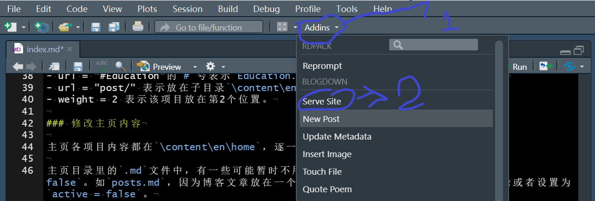
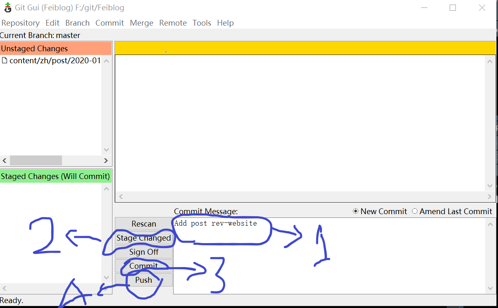

---
authors:
- admin
categories: []
date: "2020-01-28T00:00:00Z"
draft: false
featured: false
image:
  caption: ""
  focal_point: ""
projects: []
tags: []
title: 修改和维护Blogdown个人网站
---

## 修改网站名称、主题、默认语言等

一般网页文件都以项目(Project)形式建立。编辑文件时，首先打开主目录上的`.proj`文件，RStudio会自动把该目录设置为工作目录。

打开文件`config.toml`，可以修改网站名称等。

多语言设置：修改文件`\config\_default\languages.toml`。

## 修改个人信息和头像

打开子目录`\content\en\authors\admin`个人信息在`_index.md`，个人头像为`avatar.jpg`。

中英文网页是对称的，所有项目要单独修改。中文网页目录在`\content\zh\authors\admin`。

## 修改主页

### 指定导航栏项目

通过文件`\config\_default\menus.en.toml`(中文版的修改`menus.zh.toml`)指定在主页展示哪些项目，以及它们的排列次序。一般设置有 "About", "Education"，"Blog" 等。

- [[main]] 表示一个导航栏下项目
- name = "Education" 表示项目名称
- url = "#Education"的`#`号表示`Education.md`放在主页位置(`\content\en\home`)
- url = "post/" 表示放在子目录`\content\en\post`（注意是反斜杠`/`!）
- weight = 2 表示该项目放在第2个位置。

### 修改主页内容

主页各项目内容都在`\content\en\home`，逐一修改即可。

主页目录里的`.md`文件中，有一些可能暂时不用，可以设置`active = false`。如`posts.md`，因为博客文章放在一个专门目录，没有放在主页，因此可以删除或者设置为`active = false`。

## 本地调试

修改后效果如何？是否正确？可以现在本地查看，满意后才发布到网上。

方法很简单，点开`Addins`，然后点击`Serve Site`即可，见下图：

## 发布

网站内容或者博客文章更新后，需要推送到github项目。网站将随着github项目的改变而实时变化。

假设你已经安装好Git软件。

在本地主目录空白处，右键，选择`Git GUI Here`，按照下图的四个步骤操作，就可把所有变动的项目推送到github远程仓库。

## 参考

- Blogdown: https://bookdown.org/yihui/blogdown/  
- Academic: https://sourcethemes.com/academic/docs/  
- https://alison.rbind.io/slides/blogdown-workshop-slides.html#1  
- https://www.shenxt.info/zh/post/blogdown/
